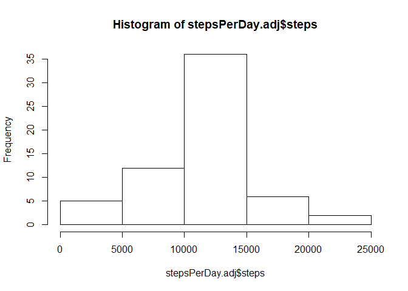

Loading and preprocessing the data
------------------------------------

* Load the data


```r
unzip("activity.zip")
activity <- read.csv("activity.csv")
```

* Process/transform data


```r
### NOT APPLICABLE - TRANSFORMATIONS DONE WITH QUESTIONS ###
```

What is mean total number of steps taken per day?
-------------------------------------

* Calculate the total number of steps taken per day


```r
stepsPerDay <- aggregate(steps~date,data=activity,na.rm=TRUE,sum)
```

* Make a Histogram of the total number of steps taken each day


```r
hist(stepsPerDay$steps)
```

<!-- -->

* Calculate and report the **mean** and **median** of the total number of steps taken per day


```r
meanSteps <- mean(stepsPerDay$steps)  
medianSteps <- median(stepsPerDay$steps)
```

The **mean** number of steps is 1.0766189\times 10^{4}.

The **median** number of steps is 10765.

What is the average daily activity pattern?
----------------------------

* Make a time series plot (i.e. type="l") of the 5-minute interval (x-axis) and the average number of steps taken, averaged across all days (y-axis)

```r
stepsByInterval <- aggregate(steps~interval,data=activity,na.rm=TRUE,mean)
plot(steps~interval,data=stepsByInterval,type="l")
```

<!-- -->

* Which 5-minute interval, on average across all the days in the dataset, contains the maximum number of steps?


```r
maxInterval <- stepsByInterval[which.max(stepsByInterval$steps),]$interval
```

The **maximum number of steps** was during the interval: 835.

Imputing missing values
-----------------------------

* Calculate and report total number of missing values in the dataset

```r
missingSteps <- sum(is.na(activity$steps))
```

There are 2304 steps entries missing from dataset 'activity'

* Devise a strategy for filling in all of the missing values in the dataset & Create a new dataset that is equal to the original dataset but with the missing data filled in.


```r
activity.adj <- activity
for(i in 1:nrow(activity.adj)){
     if(is.na(activity.adj[i,]$steps)){
          activity.adj[i,]$steps <- stepsByInterval[stepsByInterval$interval == activity.adj[i,]$interval,]$steps
     }
}
missingAdjSteps <- sum(is.na(activity.adj$steps))
```

There are 0 steps entries missing from dataset 'activity.adj'

* Make a histogram of the total number of steps taken each day 


```r
stepsPerDay.adj <- aggregate(steps ~ date, data=activity.adj,sum)
hist(stepsPerDay.adj$steps)
```

<!-- -->

* Calculate and report the **mean** and **median** total number of steps taken per day.


```r
meanSteps.adj <- mean(stepsPerDay.adj$steps)  
medianSteps.adj <- median(stepsPerDay.adj$steps)
```

The **mean** number of steps is 1.0766189\times 10^{4}.

The **median** number of steps is 1.0766189\times 10^{4}.

* Do these values differ from the estimates from the first part the assignment?

The **mean** value changed 0%.

The **median** value changed 0.0110421%.

* What is the impact of inputting missing data on the estimates of the total daily number of steps?

**There was not a particularly large impact on the total daily number of steps.**

Are there differences in activity patterns between weekdays and weekends?
-----------------------------

* Create a new factor variable in the dataset with two levels – “weekday” and “weekend” indicating whether a given date is a weekday or weekend day.


```r
activity.adj$dow <- "weekday" 
for(i in 1:nrow(activity.adj)){
     if(weekdays(as.Date(activity.adj[i,"date"]))=="Saturday"){
          activity.adj[i,]$dow <- "weekend"
     }
     if(weekdays(as.Date(activity.adj[i,"date"]))=="Sunday"){
          activity.adj[i,]$dow <- "weekend"
     } 
}
```

* Make a panel plot containing a time series plot (i.e. type="l") of the 5-minute interval (x-axis) and the average number of steps taken, averaged across all weekday days or weekend days (y-axis). See the README file in the GitHub repository to see an example of what this plot should look like using simulated data.


```r
library(lattice)
dayOfWeek <- aggregate(steps~interval+dow,activity.adj,mean)
xyplot(steps~interval|factor(dow),data=dayOfWeek,type="l",aspect=1/2)
```

<!-- -->
